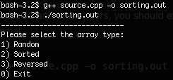
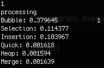
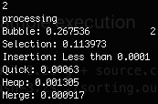
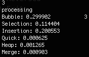

# Sorting Algorithms

<p align="justify"> 

Analysis of Algorithms is the area of computer science that provides tools to analyze the efficiency of different methods of solutions.

It recognizes limitations of various algorithms for solving a problem, to understand relationship between problem size and running time, to learn how to analyze an algorithm's running time without coding it, to learn techniques for writing more efficient code and to recognize bottlenecks in code as well as which parts of code are easiest to optimize.

This README file divided into three part. In the first part, I am going to explain the algorithms and complexities of the sorting algorithms such as the best, worst and average cases. Secondly, I will show you a table which contains the average execution times with maximum and minimum times. In the last part, I will leave some comments about efficiency of the sorting algorithms.

</p>

> #### The algorithms used in this project:
>
> - [Bubble sort](###-**Bubble-sort**)
> - [Selection sort](###-**Selection-sort**)
> - [Insertion sort](###-**Insertion-sort**)
> - [Merge sort](###-**Merge-sort**)
> - [Quick sort](###-**Quick-sort**)
> - [Heap sort](###-**Heap-sort**)

## **Algorithms**

### **Bubble sort**

First of all, I would like to start with the bubble sort and explain my code. For example, we have an array that includes five numbers “4 2 5 8 6“. Now, there are two for loops and one if statement. If statement checks that an index of the array is greater than the following index. If it is, they swap their positions and continue to next.


```cpp
void bubble(){
    for (int x = 0; x < n; x++){
        for (int y = 0; y<n - 1; y++){
            if (B[y]>B[y + 1]){
                tempBforBub = B[y + 1];
                B[y + 1] = B[y];
                B[y] = tempBforBub;
            }
        }
    }
}
```

( **4** **2** 5 8 6 ) → ( **2** **4** 5 8 6 ) Swap since 4 > 2.
<br>( 2 **4** **5** 8 6 ) → ( 2 **4** **5** 8 6 ) They are same there is no swap.
<br>( 2 4 **5** **8** 6 ) → ( 2 4 **5** **8** 6 ) They are same there is no swap.
<br>( 2 4 5 **8** **6** ) → ( 2 4 5 **6** **8** ) Swap since 8 > 6.

It is sorted now, but the algorithm does not know; therefore, the code runs until it finishes.

### **Selection sort**

The other sorting algorithm is selection sort. For instance, we have an array which has 5 numbers and they are “7 5 9 3 6”. Now, we assume that our first element is the minimum element of that array. Then, we start to check if it is really the minimum element? ( **7** 5 9 3 6 ) → 7 is the minimum for the first run. When it runs, check the 7 and 5. Now, program understand 7 is not the minimum element. It should be 5. Then, it assigns 5 as the minimum element. After checking all array elements, it decides 3 is the minimum and put 3 to the beginning of the array and 7 goes to 3's old place. All processes are working like that;

```cpp
void selection(){
    for (int x = 0; x < n; x++){
        int index_of_min = x;
        for (int y = x; y<n; y++){
            if (S[index_of_min]>S[y]){
                index_of_min = y;
            }
        }
        tempBforSel = S[x];
        S[x] = S[index_of_min];
        S[index_of_min] = tempBforSel;
    }
}
```

( **7** 5 9 **3** 6 ) swap 7 - 3 
<br>( 3 ***5*** 9 7 6 ) no swap
<br>( 3 5 **9** 7 **6** ) swap 9 - 6 
<br>( 3 5 6 ***7*** 9 ) no swap
<br>( 3 5 6 7 ***9*** ) no swap

### **Insertion sort**

Another sorting algorithm is insertion sort. Insertion sort removes one element from the input data, finds the location it belongs within the sorted list, and inserts it there. It repeats until no input elements remain. If an example should be given, we have an array with 8 elements.

```cpp
void insertion(){
    int j;
    for (int i = 0; i < n; i++){
        j = i;
        while (j > 0 && I[j] < I[j - 1]){
            tempBforIns = I[j];
            I[j] = I[j - 1];
            I[j - 1] = tempBforIns;
            j--;
        }
    }
}
```

*2* 6 3 8 4 1 5 0
<br>**2** *6* 3 8 4 1 5 0 
<br>2 **6** *3* 8 4 1 5 0 
<br>2 3 **6** *8* 4 1 5 0 
<br>2 3 6 **8** *4* 1 5 0
<br>2 3 **4** 6 8 *1* 5 0
<br>**1** 2 3 4 6 8 *5* 0
<br>1 2 3 4 **5** 6 8 *0*
<br>**0** 1 2 3 4 5 6 8

### **Merge sort**

Another sorting algorithm is merge sort. First, divide the list into the smallest unit (1 element), then compare each element with the adjacent list to sort and merge the two adjacent lists. Finally, all the elements are sorted and merged. 

```cpp
void Merge(int a[], int low, int mid, int high){
    int i = low, j = mid + 1, k = low, s;
    while (i <= mid && j <= high){
        if (a[i] < a[j]){
            tempBforMer[k] = a[i];
            i++;
        }
        else{
            tempBforMer[k] = a[j];
            j++;
        }
        k++;
    }
    if (i > mid){
        for (s = j; s <= high; s++){
            tempBforMer[k] = a[s];
            k++;
        }
    }
    else{
        for (s = i; s <= mid; s++){
            tempBforMer[k] = a[s];
            k++;
        }
    }
    for (k = low; k <= high; k++){
        a[k] = tempBforMer[k];
    }
}
void MergeSort(int a[], int low, int high){
    int mid;
    if (low < high){
        mid = (low + high) / 2;
        MergeSort(a, low, mid);
        MergeSort(a, mid + 1, high);
        Merge(a, low, mid, high);
    }
}
```

For example, we have “ 54, 26, 89, 45, 67, 82, 0, 4 ”. We divide it into two parts such as 54-26-89-45 and 67-82-0-4. Then, we divide them again. 54-26, 89-45, 67-82, 0-4. Again and again. 54 26, 89 45, 67 82, 0 4. Now, sort them. 26-54, 45-89, 67-82, 0-4. Then, merge and sort. 26-45-54-89, 0-4-67-82. For the last time again. 0-4-26-45-54-67-82-89. Now, they are sorted. It is the main idea of the algorithm.

### **Quick sort**

Another sorting algorithm is quick sort. Quick sort is a divide and conquer algorithm. It first divides a large array into two smaller sub-arrays: the low elements and the high elements. Quick sort can then recursively sort the sub-arrays. First, we pick an element which called pivot. Order again. The elements smaller than pivot element, placed before the pivot element. The elements greater than the pivot elements should be placed after the pivot element. It is called partition operation. By using that, they will be sorted recursively. 

### **Heap sort**

And the last one is heap sort. Heap sort is a comparison-based sorting algorithm. For example, we have (8, 7, 5, 3, 10, 9, 4, 6). Now, we should put them to a heap like this

|       |       |       |       |   8   |       |       |       |     |
| :---: | :---: | :---: | :---: | :---: | :---: | :---: | :---: | --- |
|       |       |   7   |       |       |       |   5   |       |     |
|       |   3   |       |  10   |       |   9   |       |   4   |     |
|   6   |       |       |       |       |       |       |       |     |

then, we should swap 7-10 because children can not be greater than parents.

|       |       |       |       |  10   |       |       |       |     |
| :---: | :---: | :---: | :---: | :---: | :---: | :---: | :---: | --- |
|       |       |   8   |       |       |       |   9   |       |     |
|       |   6   |       |   7   |       |   5   |       |   4   |     |
|   3   |       |       |       |       |       |       |       |     |

After that, start to sort this array (10, 8, 9, 6, 7, 5, 4, 3).

| Heap                            | Operation                             | Array              |
| ------------------------------- | ------------------------------------- | ------------------ |
| **10**, 8, 9, 6, 7, 5, 4, **3** | swap 10-3 to delete 10 from heap.     |
| 3, 8, 9, 6, 7, 5, 4, **10**     | delete 10 from heap and add to array. | (10)               |
| **3**, 8, **9**, 6, 7, 5, 4     | swap 3-9                              |
| 9, 8, **3**, 6, 7, **5**, 4     | swap 3-5                              |
| **9**, 8, 5, 6, 7, 3, **4**     | swap 9-4                              |
| 4, 8, 5, 6, 7, 3, **9**         | delete 9                              | (9,10)             |
| **4**, **8**, 5, 6, 7, 3        | swap 4-8                              |
| 8, **4**, 5, 6, **7**, 3        | swap 4-7                              |
| **8**, 7, 5, 6, 4, **3**        | swap 8-3                              |
| 3, 7, 5, 6, 4, **8**            | delete 8                              | (8,9,10)           |
| **3**, **7**, 5, 6, 4           | swap 3-7                              |
| 7, **3**, 5, **6**, 4           | swap 3-6                              |
| **7**, 6, 5, 3, **4**           | swap 7-4                              |
| 4, 6, 5, 3, **7**               | delete 7                              | (7,8,9,10)         |
| **4**, **6**, 5, 3              | swap 4-6                              |
| **6**, 4, 5, **3**              | swap 6-3                              |
| 3, 4, 5, **6**                  | delete 6                              | (6,7,8,9,10)       |
| **3**, 4, **5**                 | swap 3-5                              |
| **5**, 4, **3**                 | swap 5-3                              |
| 3, 4, **5**                     | delete 5                              | (5,6,7,8,9,10)     |
| **3**, **4**                    | swap 3-4                              |
| **4**, **3**                    | swap 4-3                              |
| 3, **4**                        | delete 4                              | (4,5,6,7,8,9,10)   |
| **3**                           | delete 3                              | (3,4,5,6,7,8,9,10) |

Array is sorted 3, 4, 5, 6, 7, 8, 9, 10.

## **Results**

Additionally, I would like to show you a table which includes time complexities.

|   Algorithm    | Time Complexity: Best | Time Complexity: Average | Time Complexity: Worst |
| :------------: | :-------------------: | :----------------------: | :--------------------: |
|  Bubble sort   |         O(n)          |          O(n^2)          |         O(n^2)         |
| Selection sort |        O(n^2)         |          O(n^2)          |         O(n^2)         |
| Insertion sort |         O(n)          |          O(n^2)          |         O(n^2)         |
|   Merge sort   |      O(n log(n))      |       O(n log(n))        |      O(n log(n))       |
|   Quick sort   |      O(n log(n))      |       O(n log(n))        |         O(n^2)         |
|   Heap sort    |      O(n log(n))      |       O(n log(n))        |      O(n log(n))       |

Here is a table containing execution times. I divided that table into three blocks. The first one is for randomly selected 10000 numbers. The second one is for already sorted 10000 numbers such as 0, 1, 2, 3, 4, 5... etc. The last one for reversed sorted 10000 numbers such as 9999, 9998, 9997... etc.

<p style="text-align:center;"><b>Randomly selected numbers</b></p>

|                |   1   |   2   |   3   |   4   |   5   |   6   |   7   |   8   |   9   |  10   |  Average  |
| :------------: | :---: | :---: | :---: | :---: | :---: | :---: | :---: | :---: | :---: | :---: | :-------: |
|  Bubble sort   | 0.420 | 0.383 | 0.399 | 0.375 | 0.389 | 0.391 | 0.388 | 0.388 | 0.399 | 0.389 | **0.392** |
| Selection sort | 0.111 | 0.117 | 0.116 | 0.115 | 0.117 | 0.112 | 0.121 | 0.117 | 0.112 | 0.112 | **0.115** |
| Insertion sort | 0.098 | 0.100 | 0.107 | 0.101 | 0.103 | 0.101 | 0.102 | 0.098 | 0.111 | 0.098 | **0.102** |
|   Merge sort   | 0.003 | 0.003 | 0.003 | 0.002 | 0.003 | 0.002 | 0.003 | 0.002 | 0.003 | 0.002 | **0.003** |
|   Quick sort   | 0.006 | 0.006 | 0.006 | 0.006 | 0.006 | 0.006 | 0.006 | 0.007 | 0.006 | 0.007 | **0.006** |
|   Heap sort    | 0.002 | 0.002 | 0.002 | 0.002 | 0.002 | 0.002 | 0.001 | 0.002 | 0.006 | 0.002 | **0.002** |


<p style="text-align:center;"><b>Sorted numbers</b></p>

|                |   1   |   2   |   3   |   4   |   5   |   6   |   7   |   8   |   9   |  10   |  Average  |
| :------------: | :---: | :---: | :---: | :---: | :---: | :---: | :---: | :---: | :---: | :---: | :-------: |
|  Bubble sort   | 0.250 | 0.248 | 0.246 | 0.253 | 0.247 | 0.248 | 0.243 | 0.244 | 0.250 | 0.246 | **0.248** |
| Selection sort | 0.116 | 0.117 | 0.116 | 0.114 | 0.115 | 0.113 | 0.121 | 0.116 | 0.114 | 0.113 | **0.116** |
| Insertion sort | 0.000 | 0.000 | 0.000 | 0.000 | 0.000 | 0.000 | 0.000 | 0.001 | 0.000 | 0.000 | **0.000** |
|   Merge sort   | 0.001 | 0.002 | 0.002 | 0.002 | 0.002 | 0.002 | 0.002 | 0.002 | 0.002 | 0.002 | **0.002** |
|   Quick sort   | 0.002 | 0.002 | 0.002 | 0.003 | 0.002 | 0.002 | 0.002 | 0.002 | 0.002 | 0.002 | **0.002** |
|   Heap sort    | 0.001 | 0.002 | 0.001 | 0.002 | 0.002 | 0.002 | 0.002 | 0.002 | 0.002 | 0.002 | **0.002** |


<p style="text-align:center;"><b>Sorted in reversed order numbers</b></p>

|                |   1   |   2   |   3   |   4   |   5   |   6   |   7   |   8   |   9   |  10   |  Average  |
| :------------: | :---: | :---: | :---: | :---: | :---: | :---: | :---: | :---: | :---: | :---: | :-------: |
|  Bubble sort   | 0.317 | 0.318 | 0.325 | 0.314 | 0.306 | 0.308 | 0.312 | 0.352 | 0.313 | 0.313 | **0.318** |
| Selection sort | 0.130 | 0.131 | 0.127 | 0.130 | 0.135 | 0.130 | 0.130 | 0.133 | 0.132 | 0.128 | **0.131** |
| Insertion sort | 0.207 | 0.199 | 0.198 | 0.201 | 0.198 | 0.204 | 0.204 | 0.207 | 0.198 | 0.198 | **0.201** |
|   Merge sort   | 0.002 | 0.001 | 0.002 | 0.001 | 0.002 | 0.001 | 0.001 | 0.002 | 0.002 | 0.001 | **0.002** |
|   Quick sort   | 0.003 | 0.003 | 0.004 | 0.003 | 0.004 | 0.003 | 0.003 | 0.004 | 0.003 | 0.003 | **0.003** |
|   Heap sort    | 0.002 | 0.002 | 0.002 | 0.001 | 0.002 | 0.002 | 0.001 | 0.002 | 0.002 | 0.002 | **0.002** |

## **Conculusion**

As it can be seen, there are some possible results of sorting algorithms. It depends on the array will you sort. If you want to analyze the performance of an algorithm on sorted numbers, you should definitely use the insertion sort algorithm. Because it takes an index and check one by one and there is no greater element in the array; therefore, it does not change anything. Consequently, it is finished quickly. According to the result tables, you can use heap or merge sorting algorithms to sort in minimum time.

## Usage

For macOS and Linux users, you should execute the command below to compile the source code on your terminal.
~~~~~ 
g++ source.cpp -o sorting.out
~~~~~ 
To execute the program, execute the command below.
~~~~~ 
./sorting.out
~~~~~

After the execution, you will see a menu to select the array type (sorted, reversed, random). Enter the number of your selection. It will create the array files in the folder called `files`. Then, print the performance results to the console and ask you the selection again until you enter 0 to exit. You can always change the array size by changing ```const int n = 10000; ``` in the `source.cpp` line 14.

</div>

## Example execution

|                |                |                |                |
| -------------- | -------------- | -------------- | -------------- |
|  |  |  |  |


<p align="center">
  
</p>
